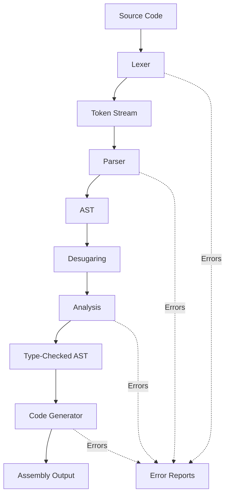

The Volette compiler is a multi-phase compiler written in Rust that transforms Volette source code into native assembly code. It follows a traditional compiler pipeline architecture with clear separation between phases.

## Architecture Principles

Volette is designed with several key principles:

- **Expression-oriented language**: Everything is an expression that produces a value
- **Static typing**: Type checking happens at compile time with type inference support
- **Native code generation**: Compiles directly to assembly using a modified Citadel backend
- **Clear phase separation**: Each compilation phase has distinct responsibilities and error handling

## Compiler Structure

The compiler is organized into the following main modules:

```
src/compiler/
├── mod.rs           # Main compilation orchestrator
├── lexer/           # Lexical analysis
├── parser/          # Syntax analysis and AST construction
├── analysis/        # Semantic analysis and type checking
├── codegen/         # Code generation (Citadel backend)
├── tokens.rs        # Token definitions
└── error.rs         # Error reporting infrastructure
```

## Compilation Flow

The compilation process follows this high-level flow:



Each phase can produce diagnostics (errors, warnings, hints) that are collected and reported to the user. If errors occur in any phase, compilation stops and all accumulated diagnostics are displayed.

## Data Structures

### String Interning

The compiler uses a `StringInterner` to deduplicate string values (identifiers, file names, etc.). This provides:

- Memory efficiency by storing each unique string once
- Fast equality comparisons using symbol handles (`SymbolUsize`)
- Efficient string lookup during analysis and code generation

### AST Representation

The Abstract Syntax Tree (AST) is stored in a `generational_arena::Arena<Node>`, which provides:

- Stable indices that don't invalidate when the arena grows
- Efficient memory layout with good cache locality
- Safe references through arena indices rather than pointers

### Error Handling

Errors use the `rootcause` library with custom handlers:

- **Phase-tagged errors**: Each error knows which compiler phase produced it
- **Severity levels**: `Hint`, `Info`, `Warning`, `Error`, `Fatal`
- **Source snippets**: Errors display relevant source code with position markers
- **Attachments**: Additional context via `Help` and `Note` messages

```rust
pub enum CompilerPhase {
    Lexing,
    Parsing,
    Analysis,
    Validation,
    Codegen,
}
```

## Error Recovery

The compiler implements error recovery strategies:

- **Lexing phase**: Reports invalid characters but continues tokenizing
- **Parsing phase**: Synchronizes to stable recovery points (e.g., function definitions, braces, semicolons)
- **Analysis phase**: Collects all type errors before stopping
- **Diagnostic accumulation**: All diagnostics are collected in a `ReportCollection` and displayed together

## Platform Support

Currently, Volette targets **aarch64 macOS** exclusively. The code generation backend is a modified version of the Citadel library adapted for Volette's type system and semantics.

## Main Entry Point

The compilation process is orchestrated by the `build()` function in `src/compiler/mod.rs:23`:

```rust
pub fn build(file: &Path, output_path: &Path)
```

This function:
1. Reads the source file
2. Initializes the string interner
3. Executes each compilation phase in sequence
4. Accumulates diagnostics from all phases
5. Writes the assembly output if compilation succeeds
6. Reports all errors and warnings to the user

See the [Compiler Pipeline](/internals/pipeline) page for detailed information about each compilation phase.