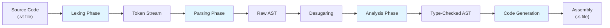
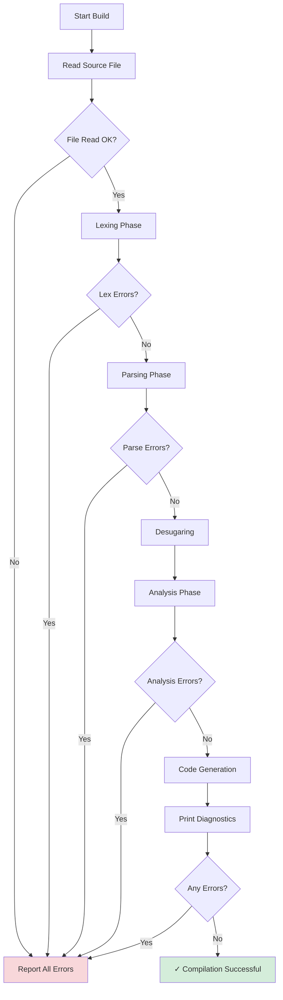

The Volette compiler processes source code through four main phases. Each phase transforms the representation and validates different aspects of the program.

## Pipeline Overview



## Phase 1: Lexing

**Location**: `src/compiler/lexer/mod.rs`

**Input**: Raw source code (string)

**Output**: Vector of `Token` objects

The lexer performs lexical analysis, breaking the source code into tokens. It operates as a state machine with the following states:

```rust
pub enum LexerState {
    Normal,
    Number(bool, NumberBase),
    String,
    Comment,
    MultilineComment,
    End,
}
```

### Lexing Process

1. **Character streaming**: Processes input character-by-character with lookahead
2. **Token recognition**: Identifies keywords, identifiers, literals, operators, and punctuation
3. **Comment handling**: Skips line comments (`//`) and block comments (`/* */`)
4. **String interning**: Stores identifiers in the string interner for efficient lookup
5. **Span tracking**: Records source location (line, column) for each token
6. **EOF token**: Appends an end-of-file marker to signal parser completion

### Implementation

```rust
fn lex_phase(
    contents: &str,
    interner: &mut StringInterner<BucketBackend<SymbolUsize>>,
    file_name: SymbolUsize,
) -> Result<Vec<Token>, ReportCollection>
```

From `src/compiler/mod.rs:107-132`:

```rust
let mut lexer = Lexer::new(interner, file_name);
lexer.tokenize(contents.chars().collect());

// Add EOF token
lexer.tokens.push(Token::new(
    TokenKind::Eof,
    Span::new(
        file_name,
        lexer.cursor.line,
        lexer.cursor.col.max(0),
        lexer.cursor.col.max(0),
        lexer.cursor.col.max(0),
    ),
));

if !lexer.errors.is_empty() {
    return Err(lexer.errors);
}
```

### Error Handling

- Detects invalid characters not in the allowed character set
- Reports malformed number literals
- Continues lexing to find multiple errors in one pass
- Returns collected errors if any were found

## Phase 2: Parsing

**Location**: `src/compiler/parser/mod.rs`

**Input**: Token stream

**Output**: AST (`Node` tree stored in `Arena<Node>`)

The parser performs syntax analysis and constructs an Abstract Syntax Tree (AST) representing the program structure.

### Parsing Process

1. **Recursive descent parsing**: Uses hand-written recursive functions for each grammar rule
2. **Operator precedence**: Implements precedence climbing for binary operators
3. **AST construction**: Builds nodes in a generational arena
4. **Error synchronization**: Recovers from parse errors at stable points

### Implementation

```rust
fn parse_phase(
    tokens: Vec<Token>,
    interner: &mut StringInterner<BucketBackend<SymbolUsize>>,
) -> Result<ResultWithDiagnostics<(Node, Arena<Node>)>, ReportCollection>
```

From `src/compiler/mod.rs:134-155`:

```rust
let mut parser = Parser::new(tokens, interner);
let root = parser.parse();

let parse_errors = std::mem::take(&mut parser.parse_errors);
let diagnostics: ReportCollection = parse_errors.into_iter().collect();

if !diagnostics.is_empty() {
    return Err(diagnostics);
}

Ok(ResultWithDiagnostics::with_diagnostics((root, parser.tree), diagnostics))
```

### Desugaring

After initial parsing, a **desugaring pass** transforms syntactic sugar into simpler core constructs:

```rust
parser::desugar::desugar(&mut root, &mut tree, &interner);
```

This simplifies the AST before analysis, handling things like:
- Compound assignment operators (`+=`, `-=`, etc.) → simple assignments with binary operations
- Other syntactic conveniences that expand to more primitive operations

### Error Recovery

When parse errors occur, the parser synchronizes by advancing to recovery points:

```rust
while self.advance().is_some_and(|t| {
    !matches!(
        t.kind,
        TokenKind::Eof
            | TokenKind::Punctuation(Punctuation::OpenParen)
            | TokenKind::Punctuation(Punctuation::OpenBrace)
            | TokenKind::Punctuation(Punctuation::Semicolon)
            | TokenKind::Keyword(Keyword::Fn)
    )
}) {}
```

This prevents cascading errors by resynchronizing at function boundaries and statement delimiters.

## Phase 3: Analysis

**Location**: `src/compiler/analysis/mod.rs`

**Input**: Desugared AST

**Output**: Function table with type signatures, type-checked AST

The analysis phase performs semantic analysis and type checking:

### Analysis Components

1. **Function table generation**: Collects all function signatures
   ```rust
   let function_table = function_table::generate_function_table(nodes);
   // Returns: HashMap<SymbolUsize, (Vec<VType>, VType)>
   //           function_name -> (parameter_types, return_type)
   ```

2. **Type checking**: Validates types throughout the program
   ```rust
   type_check::type_check_root(root, interner, nodes, &function_table)
   ```

### Implementation

```rust
fn analysis_phase(
    root: &Node,
    interner: &StringInterner<BucketBackend<SymbolUsize>>,
    nodes: &mut Arena<Node>,
) -> Result<ResultWithDiagnostics<HashMap<SymbolUsize, (Vec<VType>, VType)>>, ReportCollection>
```

From `src/compiler/mod.rs:157-169`:

```rust
let analysis_result = analyze(root, interner, nodes);

if analysis_result.has_errors() {
    Err(analysis_result.diagnostics)
} else {
    Ok(analysis_result)
}
```

### Type System

Volette's type system includes:

- **Primitive types**: `i32`, `i64`, `f32`, `f64`, `bool`, `isize`, `usize`
- **Unit type**: `unit` (represents void/empty value)
- **Struct types**: User-defined named and anonymous structs
- **Type inference**: Literals get default types (integers → `i32`, floats → `f32`)

### Error Handling

The analysis phase:
- Collects all type errors before failing
- Reports type mismatches with expected vs. actual types
- Validates function calls against signatures
- Ensures return types match function declarations

## Phase 4: Code Generation

**Location**: `src/compiler/codegen/mod.rs`

**Input**: Type-checked AST with function table

**Output**: Assembly code (.s file)

The final phase generates native assembly code using a modified Citadel backend.

### Code Generation Process

1. **AST traversal**: Walks the type-checked AST
2. **Instruction selection**: Maps Volette constructs to assembly instructions
3. **Register allocation**: Assigns registers for intermediate values
4. **Assembly emission**: Writes aarch64 assembly to the output file

### Implementation

```rust
pub fn codegen(
    root: &Node,
    nodes: &Arena<Node>,
    interner: &StringInterner<BucketBackend<SymbolUsize>>,
    output_path: &Path,
) -> Result<ReportCollection, Report>
```

From `src/compiler/mod.rs:88-99`:

```rust
match codegen::codegen(&root, &tree, &interner, output_path) {
    Ok(diag) => {
        all_diagnostics.extend(diag);
    }
    Err(e) => {
        all_diagnostics.push(e.into_cloneable());
    }
}
```

### Platform Target

Currently generates **aarch64 assembly** for macOS. The output can be assembled and linked:

```bash
# Compile Volette to assembly
cargo run -- build example.vt -o example.s

# Assemble to object file
as -o example.o example.s

# Link with C wrapper
gcc main.c example.o -o example
```

## Diagnostic Flow



All phases accumulate diagnostics in a `ReportCollection`. Compilation stops at the first phase with errors, but all diagnostics from that phase are reported together.

## Phase Communication

Data flows between phases:

| Phase | Input | Output | Shared State |
|-------|-------|--------|-------------|
| Lexing | `String` | `Vec<Token>` | `StringInterner` |
| Parsing | `Vec<Token>` | `(Node, Arena<Node>)` | `StringInterner` |
| Analysis | `Node`, `Arena<Node>` | `HashMap<SymbolUsize, (Vec<VType>, VType)>` | `StringInterner` |
| Codegen | `Node`, `Arena<Node>`, Function Table | Assembly file | `StringInterner` |

The `StringInterner` is passed through all phases to provide consistent symbol resolution.