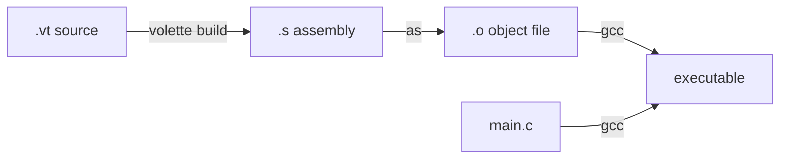

# Quickstart Guide

This guide will walk you through creating, compiling, and running your first Volette program.

## Create Your First Program

<Steps>
  <Step title="Create a Volette file">
    Create a new file called `factorial.vt`:
    
    ```volette factorial.vt
    fn factorial(n: i32): i32 {
        let result = 1
        let i = 1
        while i <= n {
            result *= i
            i += 1
        }
        return result
    }
    
    fn fib(n: i32): i32 {
        let a = 0
        let b = 1
        let i = 0
        while i < n {
            let tmp = a + b
            a = b
            b = tmp
            i += 1
        }
        return a
    }
    ```
    
    This program defines two functions:
    - `factorial(n)` - calculates the factorial of a number
    - `fib(n)` - calculates the nth Fibonacci number
  </Step>
  
  <Step title="Compile to Assembly">
    Use the Volette compiler to generate assembly code:
    
    <CodeGroup>
    ```bash With PATH
    volette build factorial.vt -o factorial.s
    ```
    
    ```bash Without PATH
    cargo run -- build factorial.vt -o factorial.s
    ```
    </CodeGroup>
    
    This creates `factorial.s` containing the compiled assembly code.
    
    <Note>
    The `-o` flag specifies the output file. If omitted, the output will be written to `output.s`.
    </Note>
  </Step>
  
  <Step title="Assemble to Object File">
    Use the system assembler to create an object file:
    
    ```bash
    as -o factorial.o factorial.s
    ```
    
    This creates `factorial.o`, which contains the machine code for your functions.
  </Step>
  
  <Step title="Create a C Wrapper">
    To call your Volette functions, create a C wrapper file called `main.c`:
    
    ```c main.c
    #include <stdio.h>
    
    extern int factorial(int n);
    extern int fib(int n);
    
    int main() {
        printf("factorial(5) = %d\n", factorial(5));
        printf("factorial(10) = %d\n", factorial(10));
        printf("fib(10) = %d\n", fib(10));
        printf("fib(15) = %d\n", fib(15));
        return 0;
    }
    ```
    
    The `extern` declarations tell C about the functions defined in your Volette code.
  </Step>
  
  <Step title="Link and Compile">
    Use `gcc` to compile the C wrapper and link it with your Volette object file:
    
    ```bash
    gcc main.c factorial.o -o factorial
    ```
    
    This creates an executable called `factorial`.
  </Step>
  
  <Step title="Run Your Program">
    Execute your program:
    
    ```bash
    ./factorial
    ```
    
    You should see:
    
    ```
    factorial(5) = 120
    factorial(10) = 3628800
    fib(10) = 55
    fib(15) = 610
    ```
  </Step>
</Steps>

## Understanding the Workflow

The Volette compilation process involves several steps:



1. **Volette Compiler** - Converts `.vt` files to assembly (`.s`)
2. **Assembler** - Converts assembly to object code (`.o`)
3. **Linker** - Combines object files into an executable

<Note>
Volette functions can be called from C code because they follow the standard C calling convention on aarch64.
</Note>

## Quick Reference

Here are the essential commands you'll use:

<CodeGroup>
```bash Build Volette code
volette build program.vt -o program.s
```

```bash Assemble to object file
as -o program.o program.s
```

```bash Link with C code
gcc main.c program.o -o executable
```

```bash Full pipeline
volette build program.vt -o program.s && \
  as -o program.o program.s && \
  gcc main.c program.o -o program && \
  ./program
```
</CodeGroup>

## Common Issues

<AccordionGroup>
  <Accordion title="Command not found: volette">
    If you haven't added Volette to your PATH, use `cargo run --` instead:
    
    ```bash
    cargo run -- build program.vt -o program.s
    ```
    
    Or follow the PATH setup instructions in the [Installation guide](/installation).
  </Accordion>
  
  <Accordion title="Compilation errors">
    Make sure you're using valid Volette syntax:
    - All variables must be declared with `let`
    - Functions must have type annotations for parameters and return types
    - Control flow expressions must have compatible branch types
  </Accordion>
  
  <Accordion title="Platform not supported">
    Volette currently only supports aarch64 macOS (Apple Silicon). Support for other platforms is planned.
  </Accordion>
</AccordionGroup>

## Next Steps

<CardGroup cols={2}>
  <Card title="Language Guide" icon="book" href="/language/types">
    Learn about Volette's syntax, types, and language features
  </Card>
  
  <Card title="Examples" icon="code" href="/examples/factorial">
    Explore more example programs and common patterns
  </Card>
</CardGroup>